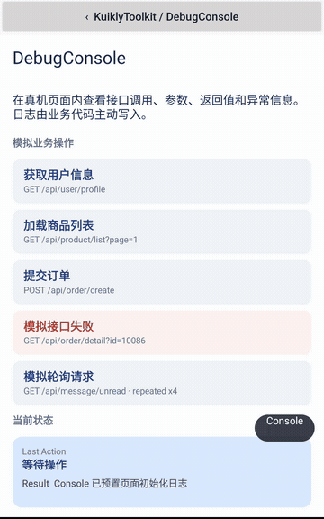

# KuiklyToolkit

Reusable Kuikly components for smoother pages and easier debugging.

[](https://github.com/Nobbyyinchen/KuiklyToolkit/actions/workflows/ci.yml)
[](LICENSE)

[简体中文](README.md) · **English**

UI components and in-app debugging tools for the **traditional Kuikly DSL**, plus a standalone KMP JSON serialization module.

**[Download preview APK](https://github.com/Nobbyyinchen/KuiklyToolkit/releases/tag/v0.1.0)** · **[Run the Android demo](docs/DEMO.md)** · **[Get started](docs/QUICK_START.md)** · **[Examples](docs/COMPONENTS.md)** · **[Compatibility](docs/COMPATIBILITY.md)**

## Category menus that change height continuously


When categories contain different numbers of menu items, a fixed-height pager leaves empty space and changing height only after settling creates a visible jump. `AdaptiveHeightPager` interpolates between the current and target heights throughout the horizontal drag.

The demo moves through 2-row, 4-row and 3-row menus. Its featured-content card stays directly below the pager and follows the gesture continuously. [Watch the MP4](docs/media/adaptive-height-pager.mp4).

The complete [AdaptivePagerDemoPage](sample/src/commonMain/kotlin/io/github/nobbyyinchen/kuikly/toolkit/sample/AdaptivePagerDemoPage.kt) runs from the independent Android demo menu. This is a bounded pager; it does not measure arbitrary content automatically or add looping pages.

## API debugging on a running device



During development, business code can append methods, parameters, responses, state transitions and failures to `DebugLogStore`, then inspect, search, filter, fold, clear and copy them through `DebugConsole` on the running Kuikly page.

The demo provides five offline mock operations covering INFO, WARN, ERROR, multiple tags and repeated polling logs. Logs are written explicitly by business code; `DebugConsole` does not automatically hook network requests or methods. [Watch the MP4](docs/media/debug-console.mp4).

| Use case | Component |
| --- | --- |
| Continuous height changes while swiping | AdaptiveHeightPager |
| A fallback during image loading or failure | StableImage |
| Mount content once near the viewport | LazyMountContainer |
| Guarded pagination with stale response rejection | PaginatedWaterfall |
| Inspect API methods, parameters, responses and failures on-device | DebugConsole / DebugLogStore |
| Apply JSON tolerance to selected fields | [Standalone serialization module](kuikly-lenient-serialization/README.md) |

## Run the demo

Requires JDK 17, Android SDK platform 34 and Python 3. Configure the SDK through `ANDROID_HOME` or an untracked `local.properties`.

```shell
git clone https://github.com/Nobbyyinchen/KuiklyToolkit.git
cd KuiklyToolkit
./gradlew :android-demo:assembleDebug
adb install -r android-demo/build/outputs/apk/debug/android-demo-debug.apk
```

Use `gradlew.bat` on Windows, or open the repository in Android Studio and run `android-demo`.

**Maven Central packages have not been published.** Use the source integration steps in [QUICK_START](docs/QUICK_START.md).

The UI and serialization modules are independent. Applications supply data, content, image URIs, logging and optional platform services through public parameters and callbacks.

## Validation

The standard build uses Kotlin `2.1.21`, Kuikly `2.23.2-2.1.21` and kotlinx.serialization `1.7.3`. HarmonyOS uses a separate KBA configuration.

The standalone workflow checks project boundaries, builds Android/JS sources, executes 16 JS tests, and builds and runs the Android demo on a fresh runner with public dependencies. Check the workflow for the current result.

Independent iOS/HarmonyOS builds, device acceptance, a JS UI host and TurboDisplay replay validation remain pending. Compilation and page-load smoke checks do not establish full interaction or device support. See the [validation matrix](docs/COMPATIBILITY.md).

[Examples](docs/COMPONENTS.md) · [Demo guide](docs/DEMO.md) · [Project boundaries](docs/INDEPENDENCE.md) · [Changelog](CHANGELOG.md) · [Roadmap](docs/ROADMAP.md) · [Contributing](CONTRIBUTING.md)

[Report an issue](https://github.com/Nobbyyinchen/KuiklyToolkit/issues/new/choose). If the project is useful to you, a Star helps you follow future updates.

[MIT License](LICENSE)
