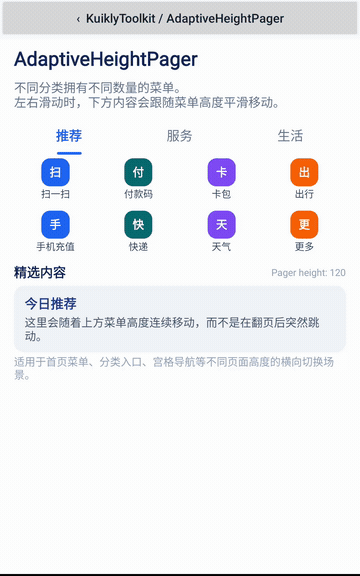

# KuiklyToolkit

让 Kuikly 页面更顺滑，让接入和调试更省事。

[](https://github.com/Nobbyyinchen/KuiklyToolkit/actions/workflows/ci.yml)
[](LICENSE)

**简体中文** · [English](README.en.md)

面向 [KuiklyUI](https://github.com/Tencent-TDS/KuiklyUI) **传统 DSL** 的通用组件与端内调试工具，另含可以独立使用的 KMP JSON 容错模块。

**[下载预览 APK](https://github.com/Nobbyyinchen/KuiklyToolkit/releases/tag/v0.1.0)** · **[运行 Android Demo](docs/DEMO.md)** · **[快速接入](docs/QUICK_START.md)** · **[组件示例与边界](docs/COMPONENTS.md)** · **[验证矩阵](docs/COMPATIBILITY.md)**



真实 Android 模拟器录屏，展示不同高度页面及跟随内容。 [MP4](docs/media/adaptive-height-pager.mp4) · [CI evidence](https://github.com/Nobbyyinchen/KuiklyToolkit/actions/runs/36396310590)

## 从一个具体问题开始

页面高度不同，横向切换时希望下方内容跟随手势连续移动？`AdaptiveHeightPager` 根据调用方提供的页面高度，随滑动进度连续调整容器高度。

```kotlin
import com.tencent.kuikly.core.views.View
import com.tencent.kuikly.core.views.Text
import io.github.nobbyyinchen.kuikly.toolkit.pager.AdaptiveHeightPager

// 放在 Kuikly Pager 的 ViewBuilder 中；每项的高度由调用方提供。
AdaptiveHeightPager {
    attr {
        pageWidth = 343f
        initPageItems(cards, height = { it.height }) { card ->
            View {
                attr { size(343f, card.height) }
                Text { attr { text(card.title) } }
            }
        }
    }
}
```

完整页面见 [AdaptivePagerDemoPage](sample/src/commonMain/kotlin/io/github/nobbyyinchen/kuikly/toolkit/sample/DemoPages.kt)，可从独立 Android Demo 菜单直接打开。组件是有边界分页器，不自动测量内容、不创建首尾循环节点。[实现说明：异高页面切换](docs/ADAPTIVE_PAGER.md)。

## 六个能力，按需使用

| 你的场景 | 能力 | 示例 |
| --- | --- | --- |
| 不同高度页面切换时需要连续过渡 | `AdaptiveHeightPager` | [分页示例](docs/COMPONENTS.md#adaptiveheightpager) |
| 图片加载中或失败时需要兜底效果 | `StableImage`，兜底图与网络图两层节点 | [图片示例](docs/COMPONENTS.md#stableimage) |
| 滚动内容接近可视区域时才需要构建 | `LazyMountContainer`，一次性懒挂载 | [懒挂载示例](docs/COMPONENTS.md#lazymountcontainer) |
| 分页需要防重复加载和旧响应覆盖 | `PaginatedWaterfall`，请求及内容由调用方提供 | [瀑布流示例](docs/COMPONENTS.md#paginatedwaterfall) |
| 希望在页面内查看、筛选和复制日志 | `DebugConsole` + `DebugLogStore` | [调试示例](docs/COMPONENTS.md#debugconsole) |
| 后端以空字符串表示非 String 字段 | 独立的 kotlinx.serialization 字段适配器 | [序列化模块](kuikly-lenient-serialization/README.md) |

## 运行与接入

环境：JDK 17、Android SDK platform 34、Python 3。SDK 通过 `ANDROID_HOME` 或未提交的 `local.properties` 配置。

```shell
git clone https://github.com/Nobbyyinchen/KuiklyToolkit.git
cd KuiklyToolkit
./gradlew :android-demo:assembleDebug
adb install -r android-demo/build/outputs/apk/debug/android-demo-debug.apk
```

Windows 使用 `gradlew.bat`。也可以在 Android Studio 中打开仓库，运行 `android-demo`。

**当前通过源码接入，Maven Central 尚未发布。** [接入指南](docs/QUICK_START.md) 提供模块集成、直接源码复用和独立序列化示例。

| 模块 | 内容 | 依赖 |
| --- | --- | --- |
| `kuikly-toolkit` | 四个 UI 组件、DebugConsole 与 DebugLogStore | 公开 Kuikly core |
| `kuikly-lenient-serialization` | JSON 字段容错适配器 | kotlinx.serialization；无 Kuikly UI 依赖 |
| `sample` | 六个演示页面与最小示例 | 本仓库两个库 |
| `android-demo` | 独立 Android 菜单与页面宿主 | sample 与公开 Android 渲染库 |

## 验证与兼容性

标准构建使用 Kotlin `2.1.21`、Kuikly `2.23.2-2.1.21`、kotlinx.serialization `1.7.3`。HarmonyOS KBA 配置单独管理。

[Standalone build](https://github.com/Nobbyyinchen/KuiklyToolkit/actions/workflows/ci.yml) 使用全新 GitHub runner、空 Gradle 缓存和公开依赖，执行独立性检查、Android/JS 编译与 16 项 JS 测试，并构建和运行 Android Demo。每次结果以工作流为准。

iOS/HarmonyOS 独立构建与设备验收、JS UI 宿主运行和 TurboDisplay 回放仍需补充。编译与模拟器页面加载不等同于全部交互和真机验证。详见[验证矩阵](docs/COMPATIBILITY.md)。

## 文档与参与

[组件文档](docs/COMPONENTS.md) · [Demo 操作说明](docs/DEMO.md) · [独立性说明](docs/INDEPENDENCE.md) · [更新记录](CHANGELOG.md) · [路线图](docs/ROADMAP.md) · [贡献指南](CONTRIBUTING.md)

遇到接入问题或有新需求，欢迎[提交 Issue](https://github.com/Nobbyyinchen/KuiklyToolkit/issues/new/choose)。如果这些组件对你有帮助，欢迎 Star，便于关注后续更新。

[MIT License](LICENSE)
